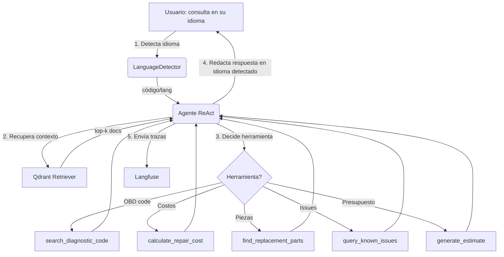

# 📦 Entrega - Asistente Empresarial con LangChain (Opción A)

Este documento resume cómo el asistente cumple los requisitos de la opción A (asistente empresarial) y recopila los enlaces de entrega.

## ✅ Checklist de requisitos

- RAG implementado con **Qdrant** (vector store local) y **HuggingFace embeddings**.
- Agente LangChain con patrón **ReAct** y herramientas autónomas.
- Uso de **PLN** (NLP) para comprensión, recuperación y generación.
- **Diagrama conversacional** en Mermaid incluido.
- **Monitoreo** con **Langfuse** (trazas accesibles) ya integrado.
- **Despliegue** con interfaz **Gradio 6** (`python app.py`).
- **Documento técnico** (este) con modelo de lenguaje y detalles.
- **Video**: grabar demo corta mostrando interacción, herramientas y trazas (pendiente de grabar por el usuario).

## 🧠 Uso de PLN y por qué es útil

- **Comprensión (NLU)**: el mensaje del usuario se limpia, se detecta el idioma y se identifica la intención (síntoma vs. código OBD-II vs. presupuesto). Esto evita menús rígidos y reduce fricción.
- **Recuperación Semántica (RAG)**: la consulta se convierte a embedding y se busca en Qdrant. Esto trae guías, síntomas y catálogos relevantes, mejorando precisión frente a búsqueda exacta.
- **Razona + Actúa (ReAct)**: el LLM decide cuál herramienta ejecutar, revisa la observación y itera. Esto habilita flujos autónomos (p.ej., busca código, luego calcula costos y arma presupuesto).
- **Generación Controlada**: el LLM sintetiza en el idioma del usuario, incluye pasos accionables y costos, cuidando contexto y formato.

## 🧭 Arquitectura resumida

- **Interfaz**: Gradio 6 (`app.py`), muestra idioma detectado, reasoning y timeline de herramientas.
- **Orquestación**: `src/agent/mechanic_agent.py` con LangChain 0.3.0, `AgentExecutor`, memoria conversacional y prompts (`src/agent/prompts.py`).
- **Herramientas**: `src/tools_impl/` (códigos OBD, costos, piezas, issues, presupuestos).
- **RAG**: `src/rag/*` con Qdrant local (`qdrant_db/`) y loader de documentos (`data/knowledge_base`).
- **NLP utilitario**: `src/utils/language_detector.py` para respuesta en idioma del usuario.
- **Modelos LLM**: OpenRouter (cadena de modelos gratuitos configurados en `src/utils/model_manager.py`).
- **Monitoreo**: Langfuse (`src/monitoring/langfuse_config.py`).

## 🗺️ Diagrama conversacional (Mermaid)



## 🔧 Detalles técnicos clave

- **LangChain**: 0.3.0 con `create_react_agent` y `AgentExecutor`.
- **LLM**: OpenRouter API (modelos gratuitos como `google/gemini-2.0-flash-exp`, `mistralai/mistral-7b-instruct`, fallback automático). Configurable vía `OPENROUTER_MODEL` y `OPENROUTER_API_KEY` en `.env`.
- **Embeddings**: SentenceTransformers (HuggingFace, local) para RAG.
- **Vector DB**: Qdrant local (`./qdrant_db`) con metadata y búsqueda semántica.
- **Memoria**: `ConversationBufferMemory` para mantener contexto.
- **Idiomas**: ES/EN/PT/FR con detección automática y respuesta en el mismo idioma.
- **Monitoreo**: Langfuse captura llamadas LLM, herramientas, latencias y costos.

## 🚀 Cómo ejecutar (despliegue local)

```bash
python -m venv venv
./venv/Scripts/Activate.ps1   # Windows
pip install -r requirements.txt
cp .env.example .env          # completar claves
python app.py                 # abre Gradio en http://localhost:7860
```

Variables mínimas en `.env`:
```
OPENROUTER_API_KEY=sk-...
OPENROUTER_MODEL=free
QDRANT_PATH=./qdrant_db
LANGFUSE_SECRET_KEY=...   # opcional pero recomendado
LANGFUSE_PUBLIC_KEY=...   # opcional
LANGFUSE_BASE_URL=https://cloud.langfuse.com
```

## 🛰️ Monitoreo (Langfuse)

- Configuración en `src/monitoring/langfuse_config.py`.
- Credenciales: `LANGFUSE_SECRET_KEY`, `LANGFUSE_PUBLIC_KEY`, `LANGFUSE_BASE_URL` en `.env`.
- Para compartir trazas: habilita proyecto en cloud.langfuse.com y genera un link público de sesión o de dashboard (pégalo abajo).

**Enlace público a trazas (pendiente de pegar):** `<link_langfuse_public>`

## 🎥 Video de demo (pendiente)

Graba un clip corto mostrando:
1) Consulta con código OBD y respuesta con reasoning + tools.
2) Consulta por síntomas y RAG en acción (referencias a documentos).
3) Vista del dashboard de Langfuse con la traza de la sesión.

**Enlace al video:** `<link_video_demo>`

## 🔗 Entregables

- Repositorio: https://github.com/AlejandroRS21/mechanic-diagnostic-assistant
- Documento de entrega: `docs/DELIVERY_ENTERPRISE_ASSISTANT.md` (este archivo)
- Video: `<link_video_demo>`
- Trazas Langfuse: `<link_langfuse_public>`

## ✅ Cómo evidenciar RAG + agente

- **RAG**: Ver `src/rag/retriever.py` y `src/rag/knowledge_base.py` (usa Qdrant, top-k=5). En traza Langfuse se listan documentos recuperados.
- **Agente**: Ver `src/agent/mechanic_agent.py` con `create_react_agent`; las herramientas se registran en `src/agent/tools.py` y su implementación en `src/tools_impl/*`.
- **Autonomía**: el agente decide cuándo invocar cada herramienta (ReAct loop) y combina observaciones en la respuesta.

---

**Última actualización:** Diciembre 2025
